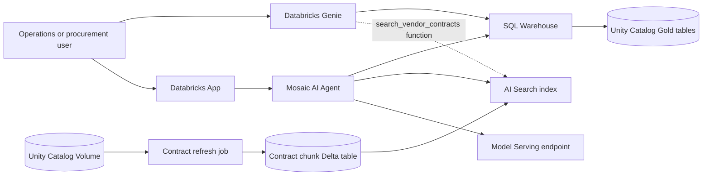

# GlobalMart Supply Chain Agents

A Databricks demonstration that combines structured inventory analytics, vendor-contract retrieval, Databricks Genie, and a Mosaic AI Agent hosted in a Databricks App.

The project supports two agent experiences over the same governed Unity Catalog data:

- **Databricks Genie**: SQL-first business exploration over inventory and vendor tables, with a Genie-facing SQL function for contract retrieval.
- **Mosaic AI Agent in a Databricks App**: A custom conversational UI that grounds answers in governed inventory queries and active AI Search contract evidence.

## What This Demonstrates

| Capability | Databricks service | Example |
| --- | --- | --- |
| Natural-language structured analytics | Genie and Databricks SQL | Calculate delayed inventory value by account manager |
| Contract RAG | Databricks AI Search | Retrieve weather exceptions, penalties, liability, and service levels |
| Custom agent experience | Mosaic AI Agent Framework and Databricks Apps | Ask mixed inventory and contract questions in a branded chat UI |
| Governed data foundation | Unity Catalog and SQL Warehouse | Catalog tables, permissions, row filters, and column masks |
| Repeatable deployment | Databricks Asset Bundles | Deploy the App and serverless data jobs |

## Architecture



### Shared data foundation

Structured demo data is stored in:

- `dim_products`
- `dim_vendors`
- `fact_inventory_status`

Contracts are uploaded to the Unity Catalog Volume, parsed into
`vendor_contract_chunks_index_source`, and synchronized to the triggered AI Search index `vendor_contract_chunks_index_rebuilt`.

The default catalog and schema are `globalmart.supply_chain`. Disposable deployments use an isolated catalog such as `dbai_demo_<workspace-id>`.

## Repository Layout

```text
app/                  Mosaic AI Agent and Databricks App UI
scripts/local/        Local control-plane, bootstrap, validation, and teardown scripts
scripts/deployable/   Databricks serverless notebook jobs synchronized by the Bundle
resources/            Databricks Bundle resource definitions
sql/                  Local Genie function and smoke-test SQL
infra/                Azure Bicep for the disposable Databricks environment
docs/                 Detailed architecture and demo walkthroughs
sample_data/          Baseline and contract-change demonstration files
tests/                Local Python tests
```

Only `app/**` and `scripts/deployable/**` are synchronized by `databricks.yml`. Local scripts, SQL, documentation, sample data, tests, infrastructure source, caches, and development files are not Bundle payload.

## Prerequisites

- Azure Databricks Premium workspace
- Databricks CLI authenticated to the target workspace
- Unity Catalog permissions to create or use the catalog, schema, Volume, tables, functions, and AI Search objects
- A serverless SQL Warehouse
- A ready chat model endpoint, by default `databricks-llama-4-maverick`
- A ready embedding endpoint, by default `databricks-qwen3-embedding-0-6b`
- Python 3.11 or later for local scripts

Install local development dependencies:

```bash
python3 -m venv .venv
.venv/bin/python -m pip install -r requirements-dev.txt
```

## Deploy to an Existing Workspace

Set the target profile and SQL Warehouse ID:

```bash
export DATABRICKS_CONFIG_PROFILE=<profile>
export DATABRICKS_SQL_WAREHOUSE_ID=<warehouse-id>
export DBAI_CATALOG=<catalog-name>
export DBAI_APP_USER=<databricks-username>
```

Validate and deploy the Bundle:

```bash
databricks bundle validate -t dev
databricks bundle deploy -t dev \
  --var="catalog=${DBAI_CATALOG}" \
  --var="sql_warehouse_id=${DATABRICKS_SQL_WAREHOUSE_ID}"
```

Bootstrap the data-plane resources:

```bash
scripts/local/deploy_workload.sh
python3 scripts/local/bootstrap_demo_environment.py \
  --target dev \
  --warehouse-id "$DATABRICKS_SQL_WAREHOUSE_ID" \
  --skip-deploy \
  --app-name dbai-dev-supply-chain-agent \
  --user-principal "$DBAI_APP_USER"
```

Bootstrap creates or updates the structured tables, contract chunk source, AI Search endpoint and index, and Genie-facing SQL function. The triggered AI Search index requires a manual sync after the contract refresh completes.

## Deploy a Disposable Azure Environment

The wrapper provisions an isolated Azure resource group and Databricks workspace with Bicep, then runs the Bundle and bootstrap workflow:

```bash
export AZURE_SUBSCRIPTION_ID=<subscription-id>
export DATABRICKS_CONFIG_PROFILE=dbai-demo
scripts/local/deploy_demo_environment.sh
```

Use the local validation script before testing:

```bash
python3 scripts/local/validate_demo_workspace.py --require-index
```

To tear down the disposable environment:

```bash
scripts/local/destroy_demo_environment.sh --yes --dry-run
scripts/local/destroy_demo_environment.sh --yes
```

## GitHub Actions Deployment

Deployment is intentionally split into separate lifecycles:

| Workflow | Trigger | Scope |
| --- | --- | --- |
| [`Deploy Infrastructure`](.github/workflows/deploy-infrastructure.yml) | Manual | Azure resource groups and Databricks workspaces |
| [`Configure Databricks Environment`](.github/workflows/configure-databricks-environment.yml) | Manual with protected environment approval | Databricks account/workspace access, catalog, SQL Warehouse, and GitHub variables |
| [`Deploy Workload`](.github/workflows/deploy-workload.yml) | Workload changes on `main`, or manual | Databricks App, jobs, and Bundle resources |
| [`Bootstrap Environment`](.github/workflows/bootstrap-environment.yml) | Manual | Catalog objects, sample data, contract chunks, AI Search, and Genie SQL function |
| [`Destroy Environment`](.github/workflows/destroy-environment.yml) | Manual with confirmation | Databricks data, App, jobs, and deployment-owned Azure resource groups |

`Deploy Workload` does not run Bicep or bootstrap data. This keeps normal SDLC
releases fast and prevents an application change from recreating infrastructure
or reloading demo data. `Deploy Infrastructure` is run once for each of `dev`,
`test`, and `prod`, and again only when Azure infrastructure changes.

`Destroy Environment` is a manually triggered destructive workflow. Select the
target GitHub Environment and enter `DESTROY` exactly in the confirmation
field. It uses the environment's OIDC credentials and only targets the
deployment-owned resource groups validated by the teardown script.
Azure platform resource groups such as `NetworkWatcherRG` are intentionally
preserved.

All workflows use GitHub OIDC with an Entra service principal. They do
not use a Databricks personal access token or a browser login.

Complete the Azure and GitHub setup from an administrator terminal. The script
uses the administrator's existing `az login` and `gh auth login` sessions; no
credentials need to be sent to the repository or entered in chat:

```bash
az login
az account set --subscription <subscription-id>
gh auth login
scripts/local/configure_github_azure.sh \
  --repo arvinddhasmana/dbai \
  --subscription-id <subscription-id>
```

The script creates or reuses the Entra application, service principal, one
federated credential per GitHub Environment, subscription role assignment, and
the GitHub Environment settings. It uses `Contributor` by default; pass
`--role <custom-role-name>` when a narrower Azure role is required.

The script configures these GitHub Environment settings:

- **Actions secrets** `AZURE_CLIENT_ID` and `AZURE_TENANT_ID`
- **Actions variables** `AZURE_SUBSCRIPTION_ID`, `AZURE_LOCATION`,
  `DBAI_RESOURCE_GROUP`, `DBAI_MANAGED_RESOURCE_GROUP`, and
  `DBAI_WORKSPACE_NAME`
- Optional **Actions variables** `DBAI_CATALOG`,
  `DATABRICKS_SQL_WAREHOUSE_ID`, `DBAI_APP_USER`, `MODEL_ENDPOINT`, and
  `AI_SEARCH_ENDPOINT`

The **Configure Databricks Environment** workflow also requires an environment
secret named `GH_ADMIN_TOKEN`. Set it to a repository-authorized GitHub token
with the repository permission **Environments: Read and write**.
For a fine-grained PAT, select `arvinddhasmana` as the resource owner, limit
repository access to `arvinddhasmana/dbai`, and approve the token if GitHub
requires approval. Alternatively, use a classic PAT with the `repo` scope. The
default `GITHUB_TOKEN` cannot update environment variables through the GitHub
API, even when the workflow declares `actions: write`.

After the workspace is deployed, run the protected **Configure Databricks
Environment** workflow for the selected environment. It uses a separate
Databricks OAuth M2M service principal, not the lower-privilege Azure deployment
identity, and resolves the current workspace URL and ID from Azure on every run.
The workflow is safe to rerun after workspace recreation.

`DBAI_APP_USER` must be an email address for the Databricks OBO user. The
workflow creates the account user when needed, assigns it to the selected
workspace, waits for propagation, and then applies its permissions.

### One-time Databricks administrator setup

An existing Databricks account administrator must perform these steps once:

1. Create a dedicated Databricks-managed automation service principal, for
  example `dbai-databricks-bootstrap-admin`.
2. Grant it the **account admin** role. This is required for account service
  principal registration and workspace assignment.
3. Create a Databricks OAuth M2M secret for it with the `all-apis` scope. This
  workflow manages account, SCIM, Unity Catalog, SQL Warehouse, and permission
  APIs. Record the client ID and secret immediately; the secret is shown only
  once.
4. Assign the service principal to each target workspace and grant it workspace
  administrator access. This is required for SCIM entitlements, SQL Warehouse
  permissions, Unity Catalog grants, and endpoint permissions.
5. In each GitHub Environment (`dev`, `test`, and `prod`), add these protected
  values:

  - Secret `DATABRICKS_ADMIN_CLIENT_ID`: the bootstrap service principal client ID
  - Secret `DATABRICKS_ADMIN_CLIENT_SECRET`: its Databricks OAuth secret
  - Variable `DATABRICKS_ACCOUNT_ID`: the Databricks account ID

Configure required reviewers on environments where administrator approval is
required, especially `prod`. Do not put the OAuth secret in a repository
variable, commit it, or print it in logs.

Run the workflow after **Deploy Infrastructure** and select the same
environment. Optionally provide `app_user`; otherwise it uses the
`DBAI_APP_USER` environment variable. The workflow discovers the
workspace-specific isolated catalog, creates or reuses the environment SQL
Warehouse, grants the deployment service principal the required prerequisites,
and writes `DBAI_CATALOG`, `DATABRICKS_SQL_WAREHOUSE_ID`, and `DBAI_APP_USER` to
only the selected GitHub Environment. The account administrator setup above is
the only manual Databricks permission step.
The Databricks account ID is shown in the Databricks account console under
account settings. It is not the Azure subscription ID or the workspace ID.

The default resource names are `rg-dbai-<environment>` and `dbai-<environment>`,
so those variables can be omitted when using the Bicep defaults.
`DBAI_CATALOG`, `DATABRICKS_SQL_WAREHOUSE_ID`, and `DBAI_APP_USER` are required
for the complete workload and bootstrap path.

Use the same live Entra application client ID for both scripts. If more than
one Entra application has the display name `dbai-github-actions`, pass it
explicitly to the GitHub script with `--client-id <azure-client-id>`; the
script will not guess between duplicate display names. The Databricks
configuration script validates the supplied ID format before registering or
assigning its Databricks service principal. The Databricks account API performs
the live application validation without requiring the GitHub OIDC identity to
have Microsoft Graph directory-read permissions.

Azure `Contributor` does not grant Databricks data-plane permissions. The
protected configuration workflow grants workspace access, SQL Warehouse access, and
catalog/schema prerequisites in the selected workspace. It also grants the
deployment service principal `MANAGE` on the isolated catalog so the
non-interactive Bootstrap workflow can delegate final access to the App service
principal and OBO user. Bootstrap preflights
existing ingestion tables with `SELECT` and `MODIFY` for the job identity, then grants
the configured App user and App service principal access to the Gold tables,
search index table, search function, and AI Search endpoint. Bundle-created jobs
and the App are owned by the deployment identity.

`Deploy Infrastructure` runs `scripts/local/deploy_infrastructure.sh`.
`Deploy Workload` logs in with `azure/login`, sets `DBAI_AUTH_MODE=azure-cli`,
and runs `scripts/local/deploy_workload.sh` against the existing workspace. The
workload script updates the Bundle-managed jobs and App resource, and uploads
the complete `app/` directory to the Bundle workspace path; it does not start
or deploy the App revision before the AI Search index exists.
`Bootstrap Environment` uses the same OIDC session to run
`scripts/local/bootstrap_demo_environment.py`. It creates the data and AI
Search objects, grants the configured `DBAI_APP_USER` and App service
principal, then runs `scripts/local/deploy_app.sh` to start the App and deploy
the App revision. The AI Search helper obtains its bearer token from the
non-interactive Azure CLI session. No long-lived credential is stored in the
repository.

The first-time order is **Deploy Infrastructure**, **Configure Databricks
Environment**, **Deploy Workload**, and then **Bootstrap Environment**. Bootstrap
uses `--skip-deploy`, so the workload must already be deployed. The App starts
and deploys only after Bootstrap creates the data and AI Search objects.

If an App was created before App revision deployment was added, activate it
after Bootstrap with the same helper used by the workflow:

```bash
scripts/local/deploy_app.sh
```

Keep the federated credential subject restricted to the intended GitHub
Environment. Required reviewers can be enabled for `test` or `prod` as an
optional release approval; that is separate from authentication.

## Use Databricks Genie

The Genie-facing SQL function is defined in `sql/01_genie_search.sql`. Run it in a Databricks SQL editor using the target catalog, or use the bootstrap script to execute it automatically.

Create a Genie space over:

- `<catalog>.<schema>.dim_products`
- `<catalog>.<schema>.dim_vendors`
- `<catalog>.<schema>.fact_inventory_status`
- `<catalog>.<schema>.vendor_contract_chunks_index_rebuilt`
- `<catalog>.<schema>.search_vendor_contracts`, when contract questions are enabled

Useful Genie questions:

- Which inventory is delayed and what is its value?
- What is the value of delayed inventory associated with Sarah Jenkins?
- Which vendor supplies the Thermal Winter Coats?
- What are the weather-delay rules for Gold Tier vendors in the Midwest?

Genie is the SQL-first experience. Unity Catalog and SQL Warehouse enforce data access; the agent prompt does not replace those controls.

## Use the Mosaic AI Agent App

Open the deployed Databricks App and ask structured, contract, or mixed questions. The App uses an AgentServer hosted by Databricks Apps and a Databricks model-serving endpoint for final answer generation.

Example questions:

- `Which inventory is delayed and what is its value?`
- `What are the weather-delay rules for VEND-789?`
- `Which vendor supplies the Thermal Winter Coats, and what is their current transit status?`

The App executes governed inventory and contract lookups server-side, then gives authoritative results to the answer writer. This avoids relying on model-generated SQL or unsupported textual tool calls. Contract answers include source-file and chunk citations when evidence is available.

The browser keeps conversation history in memory. Refreshing the page starts a new conversation.

## Run Data Jobs

The deployable jobs are registered in `resources/dbai.resources.yml`:

```bash
databricks bundle run generate_mock_data -t dev
databricks bundle run refresh_vendor_contract_chunks -t dev \
  --notebook-params INGESTION_MODE=full_rebuild
databricks bundle run upsert_demo_vendor -t dev
```

After refreshing contract chunks, trigger the configured AI Search index synchronization and wait for its update status to become completed before testing contract questions.

## Test and Validate Locally

```bash
.venv/bin/python -m pytest -q
.venv/bin/python -m compileall -q app/agent_server scripts/deployable
bash -n scripts/local/deploy_demo_environment.sh scripts/local/destroy_demo_environment.sh
```

Workspace preflight:

```bash
python3 scripts/local/validate_demo_workspace.py \
  --warehouse-id "$DATABRICKS_SQL_WAREHOUSE_ID" \
  --require-index
```

## Governance and Operational Notes

- Inventory access uses the signed-in Databricks identity and SQL Warehouse permissions.
- The inventory lookup is read-only and limited to the approved Gold tables.
- AI Search is a serving copy of contract data; source-table permissions do not automatically provide authorization for indexed content.
- The AI Search source must remain a regular Delta table with Change Data Feed enabled. Streaming Tables and Materialized Views are not valid sources for this deployment.
- The local scripts are intentionally outside the Bundle synchronization set.
- Do not commit `.env`, `.databricks/`, `.dbai-state/`, `.azure/infrastructure-plan.json`, virtual environments, caches, or generated reports.

## Further Documentation

- [Business use case and demo guide](docs/01-business-use-case-and-demo-guide.md)
- [Technical architecture](docs/02-technical-architecture-c4.md)
- [Technical execution walkthrough](docs/03-technical-execution-walkthrough.md)
- [Contract change demo](docs/05-contract-change-demo.md)
- [Start To End Setup](docs/Start%20To%20End%20Setup.md)
- [Local script process map](docs/07-local-script-process-map.md)
