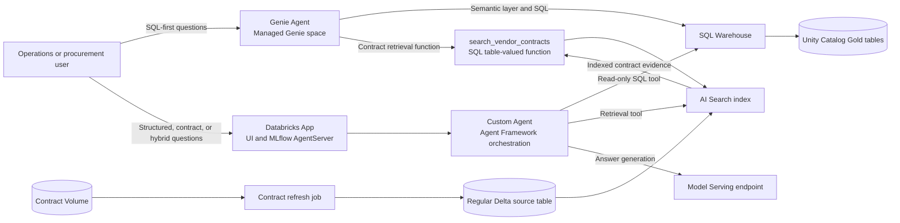
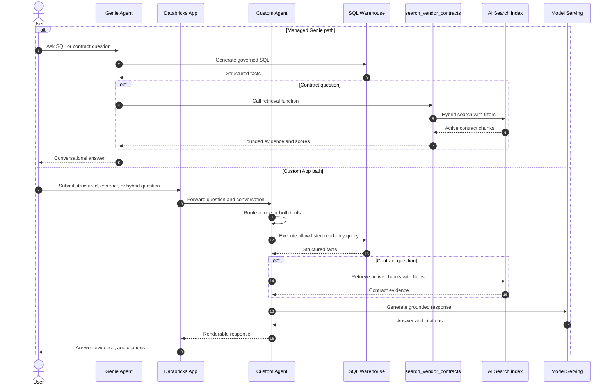
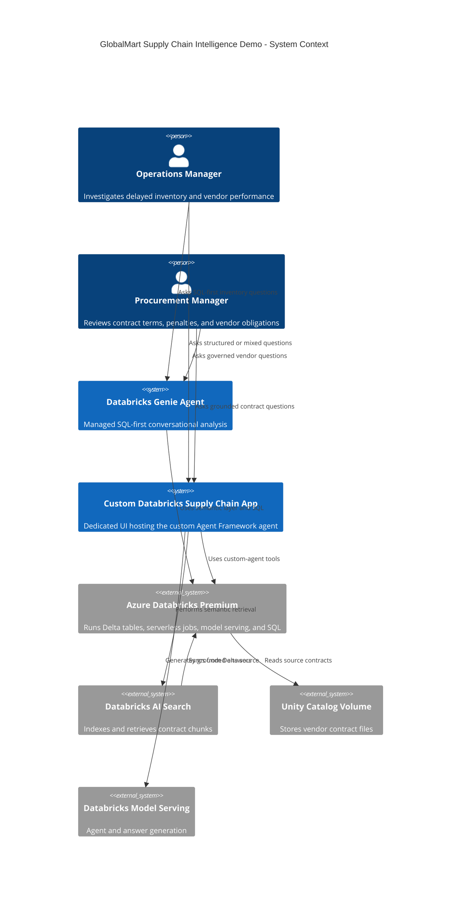
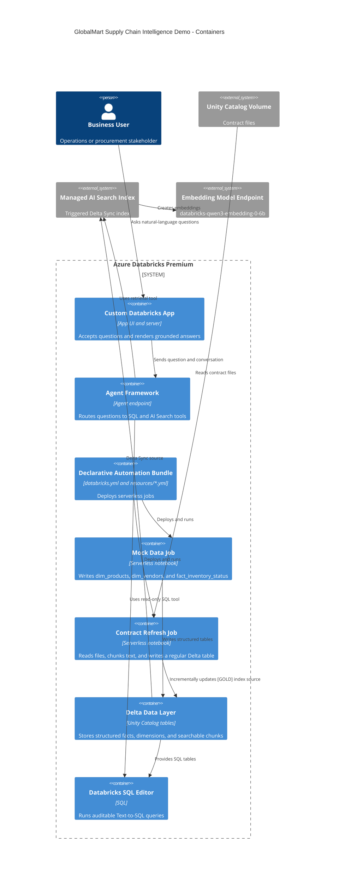
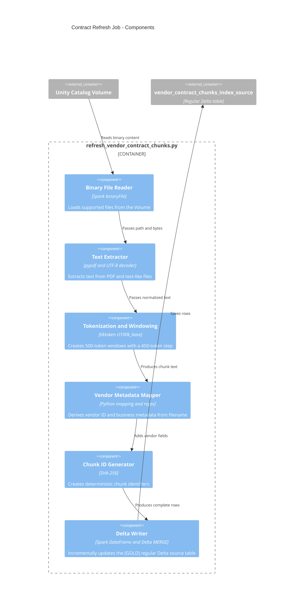
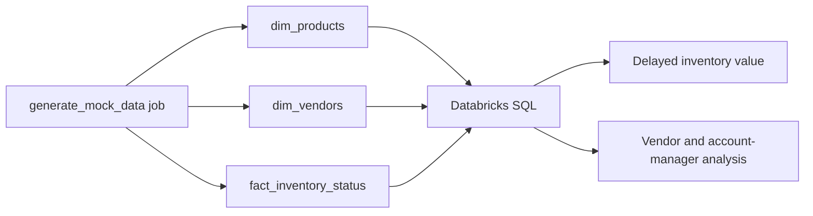

```mermaid
flowchart LR
    A[Contract files in Unity Catalog Volume] --> B[Batch binaryFile read]
    B --> C{File type}
    C -->|PDF| D[pypdf text extraction]
    C -->|TXT MD CSV JSON HTML| E[UTF-8 decode]
    D --> F[Normalize whitespace]
    E --> F
    F --> G[tiktoken cl100k_base]
    G --> H[500-token windows]
    H --> I[450-token step]
    I --> J[50-token overlap]
    J --> K[Vendor metadata mapping]
    K --> L[Deterministic SHA-256 chunk_id]
    L --> M[Regular Delta source table]
    M --> N[Triggered Delta Sync]
    N --> O[Managed AI Search index]
```

# GlobalMart Technical Architecture

## 1. Scope

This document describes the deployed Azure Databricks Premium architecture for the GlobalMart supply-chain RAG and Text-to-SQL demonstration.

The implementation uses one contract dataset: `vendor_contract_chunks_index_source`, a regular Delta table written by a serverless batch refresh job and consumed by the managed AI Search index. The earlier Lakeflow pipeline and duplicate outputs were removed because this workspace does not accept Streaming Tables or Materialized Views as AI Search sources.

The deployed design supports three complementary conversational experiences:
Databricks Genie for SQL-first exploration, a custom Agent Framework agent for
explicit SQL and retrieval orchestration, and a Databricks App that hosts that
custom agent behind a dedicated user interface. Genie and the custom agent use
the same governed data foundation but have different interaction and control
boundaries.

## 2. Architecture Options

| Option | Demo speed | Initial cost | Hybrid SQL + RAG control | User experience | Best fit |
|---|---:|---:|---|---|---|
| Genie Agent with semantic layer and search UDF | Fastest if supported | Lowest | Medium; depends on UDF and Genie behavior | Built-in BI chat | SQL-first BI questions with limited retrieval |
| Agent Framework endpoint with SQL and AI Search tools | Fast | Low/medium | High | AI Playground or API initially | Reliable conversational orchestration |
| Custom Databricks App with Agent Framework | Medium | Medium | Highest | Dedicated branded chat and citations | This project and production-style demos |

Genie is the least expensive proof of concept when its semantic layer can call the required search function. A search UDF can be a platform dependency and may be awkward for returning ranked chunks, applying filters, and exposing citations. Agent Framework makes tool selection, SQL safety, retrieval, grounding, and observability explicit.

## 3. Three Conversational Experiences

The system does not select one conversational architecture. It exposes the
same business domain through three complementary paths:

| Experience | Implementation | Primary interaction | Strength |
|---|---|---|---|
| Genie Agent | Databricks Genie space over Unity Catalog tables and `search_vendor_contracts` | User asks questions in the Genie UI | Fast SQL-first analysis with a managed conversational experience |
| Custom Agent | Agent Framework orchestration in `app/agent_server/agent.py`, with governed tools in `data_tools.py` and SQL validation in `sql_guard.py` | User asks questions through the App, or the agent is invoked through its hosting boundary | Explicit routing, read-only SQL, retrieval grounding, and citations |
| Databricks App | Databricks App serving the MLflow AgentServer and the UI in `app/static/index.html` | User interacts with a dedicated chat application | Branded interaction, conversation state, evidence presentation, and application controls |

The custom agent and Databricks App are one deployed product boundary: the App
hosts the custom agent. They are listed separately because the agent is the
reasoning implementation while the App is the user-facing runtime and delivery
surface. There is no second independent custom-agent data store.

### Shared data and control plane

All three experiences use the same governed resources:

- Unity Catalog Gold tables provide structured inventory and vendor facts.
- The contract Volume is the source for the batch refresh job.
- `vendor_contract_chunks_index_source` is the regular Delta source for AI Search.
- `vendor_contract_chunks_index_rebuilt` serves active contract chunks.
- `search_vendor_contracts` exposes bounded retrieval to Genie and SQL clients.
- SQL Warehouse, Unity Catalog permissions, row filters, and column masks remain
    enforcement points rather than prompt instructions.
- The model-serving endpoint generates answers for the custom agent; Genie uses
    its managed semantic and model experience.

The custom agent follows this path:

1. The user submits a natural-language question through the Databricks App.
2. `agent.py` routes the question to structured SQL, contract retrieval, or both.
3. `data_tools.py` executes allow-listed read-only SQL or queries the managed
     AI Search index with optional vendor, tier, and region filters.
4. `sql_guard.py` rejects disallowed SQL before the SQL Warehouse is called.
5. The model combines governed facts and retrieved evidence, then returns
     citations and a grounded answer to the App UI.

The Genie path uses the same tables and retrieval function through the Genie
semantic layer. The App path adds explicit orchestration and user-visible
evidence handling; neither path bypasses Unity Catalog or endpoint permissions.

## 4. Experience Overview

The following view shows how the three experiences are implemented around the
shared platform resources:

The user can choose Genie for managed SQL-first exploration or the App for
custom orchestration and a dedicated interface. The custom agent is not a
separate user interface: it is hosted by the App and calls the same SQL,
function, and search resources.

The two request paths have different control points:

## 5. System Context, C4 Level 1

Deployment compatibility is checked by
`scripts/local/validate_demo_workspace.py` before AI Search provisioning. It verifies
that the source is a regular Delta table with Change Data Feed and the required
schema; it rejects Streaming Tables and Materialized Views. Unity Catalog row
filters, column masks, and privileges remain workspace governance controls and
must not be inferred from the agent prompt. AI Search authorization requires a
separate design because the managed index is a serving copy of the source.

## 6. Container Diagram, C4 Level 2

## 7. Component Diagram, C4 Level 3

## 8. Data Flow

## 9. Structured Analytics Flow

## 10. Key Contracts and Names

| Resource | Value |
|---|---|
| Workspace | `https://adb-7405616725207770.10.azuredatabricks.net` |
| Bundle | `dbai` |
| Target | `dev` |
| Catalog/schema | `globalmart.supply_chain` |
| Contract Volume | `/Volumes/globalmart/supply_chain/vendor_contracts` |
| Structured tables | `dim_products`, `dim_vendors`, `fact_inventory_status` |
| AI Search source | `vendor_contract_chunks_index_source` |
| Managed index | `vendor_contract_chunks_index_rebuilt` |
| AI Search endpoint | `globalmart-supply-chain-search` |
| Embedding endpoint | `databricks-qwen3-embedding-0-6b` |
| Index mode | `TRIGGERED` |
| Window size | 500 tokens |
| Window step | 450 tokens |
| Overlap | 50 tokens |

## 11. Operational Design

The structured data job is an explicit serverless notebook run. The contract source refresh is also an explicit serverless notebook run because it performs a batch overwrite of the regular Delta source. The AI Search index is triggered separately after the source table refresh completes.

This separation makes freshness visible:

1. Source files are uploaded or replaced.
2. Contract refresh job completes.
3. AI Search sync is triggered.
4. Index status becomes Online and update status becomes Completed.
