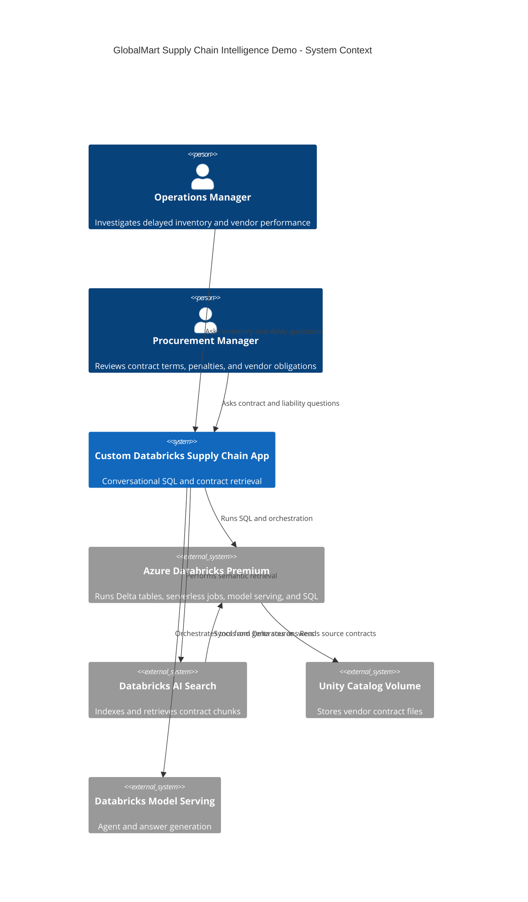
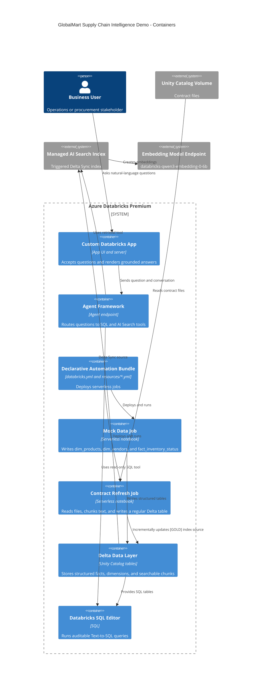
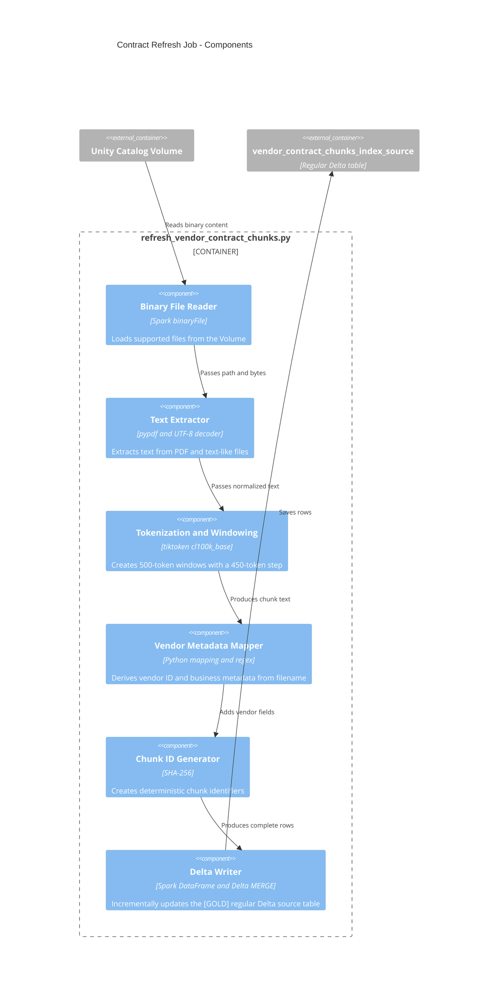
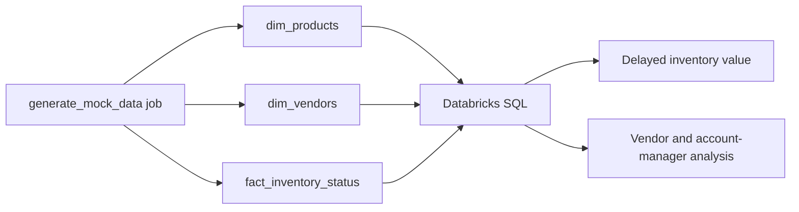

# GlobalMart Technical Architecture

## 1. Scope

This document describes the deployed Azure Databricks Premium architecture for the GlobalMart supply-chain RAG and Text-to-SQL demonstration.

The implementation uses one contract dataset: `vendor_contract_chunks_index_source`, a regular Delta table written by a serverless batch refresh job and consumed by the managed AI Search index. The earlier Lakeflow pipeline and duplicate outputs were removed because this workspace does not accept Streaming Tables or Materialized Views as AI Search sources.

The selected conversational architecture is a Custom Databricks App. It provides the user interface and explicitly orchestrates structured SQL, AI Search retrieval, and grounded answer generation.

## 2. Architecture Options

| Option | Demo speed | Initial cost | Hybrid SQL + RAG control | User experience | Best fit |
|---|---:|---:|---|---|---|
| Genie Agent with semantic layer and search UDF | Fastest if supported | Lowest | Medium; depends on UDF and Genie behavior | Built-in BI chat | SQL-first BI questions with limited retrieval |
| Agent Framework endpoint with SQL and AI Search tools | Fast | Low/medium | High | AI Playground or API initially | Reliable conversational orchestration |
| Custom Databricks App with Agent Framework | Medium | Medium | Highest | Dedicated branded chat and citations | This project and production-style demos |

Genie is the least expensive proof of concept when its semantic layer can call the required search function. A search UDF can be a platform dependency and may be awkward for returning ranked chunks, applying filters, and exposing citations. Agent Framework makes tool selection, SQL safety, retrieval, grounding, and observability explicit.

## 3. Selected Architecture: Custom Databricks App

The app is a thin conversational product layer over Databricks services:

1. The user submits a natural-language supply-chain question to the App.
2. The App's AgentServer classifies the request as structured, contract-oriented, or hybrid.
3. The SQL tool generates and validates read-only SQL, then executes it against the SQL Warehouse.
4. The AI Search tool queries `vendor_contract_chunks_index_rebuilt` with vendor, tier, or region filters when available.
5. The agent combines returned facts and contract evidence into one answer with source-file and chunk citations.
6. The app renders the answer, citations, and a concise evidence trace.

The App is both the interface and AgentServer hosting boundary; Agent Framework
is the reasoning and orchestration layer. The SQL Warehouse, Delta tables,
Volume, AI Search endpoint, embedding endpoint, and managed index remain
platform services rather than app-owned data stores.

The app should enforce read-only SQL, allow-list the three demo tables, cap result sizes, pass user identity to Databricks tools, and return a transparent fallback when SQL or retrieval is unavailable.

Deployment compatibility is checked by
`scripts/local/validate_demo_workspace.py` before AI Search provisioning. It verifies
that the source is a regular Delta table with Change Data Feed and the required
schema; it rejects Streaming Tables and Materialized Views. Unity Catalog row
filters, column masks, and privileges remain workspace governance controls and
must not be inferred from the agent prompt. AI Search authorization requires a
separate design because the managed index is a serving copy of the source.

## 4. System Context, C4 Level 1

## 5. Container Diagram, C4 Level 2

## 4. Component Diagram, C4 Level 3

## 7. Data Flow

```mermaid
flowchart LR
    A[Contract files in Unity Catalog Volume] --> B[Batch binaryFile read]
    B --> C{File type}
    C -->|PDF| D[pypdf text extraction]
    C -->|TXT MD CSV JSON HTML| E[UTF-8 decode]
    D --> F[Normalize whitespace]
    E --> F
    F --> G[tiktoken cl100k_base]
    G --> H[500-token windows]
    H --> I[450-token step]
    I --> J[50-token overlap]
    J --> K[Vendor metadata mapping]
    K --> L[Deterministic SHA-256 chunk_id]
    L --> M[Regular Delta source table]
    M --> N[Triggered Delta Sync]
    N --> O[Managed AI Search index]
```

## 8. Structured Analytics Flow

## 9. Key Contracts and Names

| Resource | Value |
|---|---|
| Workspace | `https://adb-7405616725207770.10.azuredatabricks.net` |
| Bundle | `dbai` |
| Target | `dev` |
| Catalog/schema | `globalmart.supply_chain` |
| Contract Volume | `/Volumes/globalmart/supply_chain/vendor_contracts` |
| Structured tables | `dim_products`, `dim_vendors`, `fact_inventory_status` |
| AI Search source | `vendor_contract_chunks_index_source` |
| Managed index | `vendor_contract_chunks_index_rebuilt` |
| AI Search endpoint | `globalmart-supply-chain-search` |
| Embedding endpoint | `databricks-qwen3-embedding-0-6b` |
| Index mode | `TRIGGERED` |
| Window size | 500 tokens |
| Window step | 450 tokens |
| Overlap | 50 tokens |

## 10. Operational Design

The structured data job is an explicit serverless notebook run. The contract source refresh is also an explicit serverless notebook run because it performs a batch overwrite of the regular Delta source. The AI Search index is triggered separately after the source table refresh completes.

This separation makes freshness visible:

1. Source files are uploaded or replaced.
2. Contract refresh job completes.
3. AI Search sync is triggered.
4. Index status becomes Online and update status becomes Completed.
