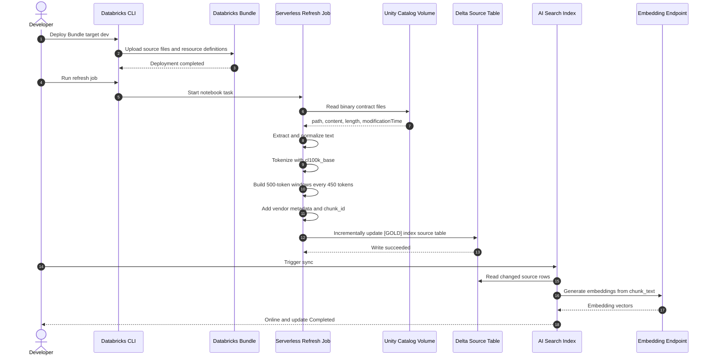
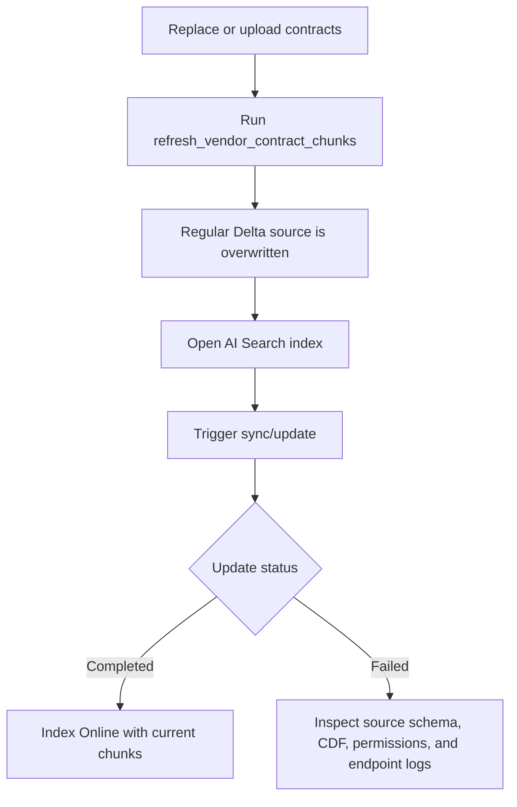

# GlobalMart Technical Execution Walkthrough

## 1. Implementation Runtime Sequence



## 2. Developer Ownership And Script Orchestration

`databricks.yml` defines the Bundle target and source synchronization.
`resources/dbai.resources.yml` defines the serverless jobs. The Bundle deploys
the App and jobs; it does not by itself populate tables, synchronize AI Search,
or configure the Genie function.

The local scripts divide those responsibilities into explicit boundaries:

| Boundary | Owning implementation | Developer concern |
|---|---|---|
| Azure infrastructure | `infra/main.bicep`, `scripts/local/deploy_infrastructure.sh` | Create the workspace and deployment-owned Azure resources. |
| Identity and administrator setup | `scripts/local/configure_github_azure.sh`, `scripts/local/configure_databricks_environment.sh` | Establish OIDC, service-principal access, catalog, warehouse, and bootstrap permissions. |
| Bundle workload | `scripts/local/deploy_workload.sh`, `databricks.yml`, `resources/dbai.resources.yml` | Validate and deploy the App and serverless jobs. |
| Data-plane bootstrap | `scripts/local/bootstrap_demo_environment.py` | Create or verify data objects, run data jobs, upload baseline files, validate compatibility, provision AI Search, create the Genie function, and grant runtime access. |
| Shared clients and constants | `scripts/local/demo_environment.py` | Centralize catalog, table, Volume, index, endpoint, authentication, SQL, and file-operation helpers used by local workflows. |
| App activation | `scripts/local/deploy_app.sh`, `app/` | Start the deployed App and publish its current revision after the agent resources are ready. |
| Readiness and recovery | `scripts/local/validate_demo_workspace.py`, `scripts/local/create_vendor_contract_index.py`, `scripts/local/grant_data_access.py` | Check source compatibility and repair index or permission state without rerunning the complete bootstrap. |
| Lifecycle demo | `scripts/local/run_contract_change_demo.py` | Mutate controlled Volume files and invoke the incremental refresh and vendor upsert jobs. |
| Teardown | `scripts/local/destroy_demo_environment.py`, `scripts/local/destroy_demo_environment.sh`, `scripts/local/cleanup_local_databricks.sh` | Remove Databricks objects, Azure resources, or local CLI state according to the selected scope. |

The complete process map, including all local entry points and command
sequences, is in [Local Script Process Map](07-local-script-process-map.md).
The canonical setup and recovery procedure is in [Start To End Setup](Start%20To%20End%20Setup.md).

## 3. Structured Data Implementation

The notebook creates three Delta tables in `globalmart.supply_chain`:

- `dim_products`: product IDs, names, SKUs, categories, and decimal unit costs.
- `dim_vendors`: vendor IDs, names, support tiers, regions, and account managers.
- `fact_inventory_status`: dated inventory status by product, vendor, and warehouse.

The notebook uses overwrite mode with schema replacement. This makes the demo repeatable, but it should be replaced with an incremental production ingestion pattern for live data.

## 4. Contract File Discovery

Source location:

```text
/Volumes/globalmart/supply_chain/vendor_contracts
```

The refresh job uses Spark `binaryFile` to read the complete file content and metadata. It accepts these extensions:

- `.pdf`
- `.txt`
- `.md`
- `.csv`
- `.json`
- `.html`

For PDFs, `_extract_text` uses `pypdf.PdfReader`. All other supported files are decoded as UTF-8 with replacement for invalid bytes.

## 5. Text Normalization

The implementation calls:

```python
" ".join(text.split())
```

This removes repeated whitespace, line breaks, and blank lines before tokenization. The semantic text remains, but formatting boundaries are flattened. This produces consistent token windows across PDF and text inputs.

## 6. Tokenization And Windowing

The job loads:

```python
encoder = tiktoken.get_encoding("cl100k_base")
```

Token counts are based on this tokenizer, not on words or characters. The same encoder is used when populating `token_count`.

For a document with token sequence `T`, the chunk windows are generated as:

```python
T[0:500]
T[450:950]
T[900:1400]
T[1350:1850]
```

The window size is 500 and the start offset is 450. Therefore adjacent windows share 50 tokens:

```text
500 - 450 = 50
```

The last window is shorter when fewer than 500 tokens remain.

## 7. Vendor Metadata

The filename is matched with:

```python
r"VEND[-_]?(\d+)"
```

Examples:

| Filename | Vendor ID | Tier | Region |
|---|---|---|---|
| `Contract_VEND789_Gold.txt` | `VEND-789` | Gold | Midwest |
| `Contract_VEND456_Silver.txt` | `VEND-456` | Silver | Northeast |
| `Contract_VEND123_Bronze.txt` | `VEND-123` | Bronze | West |

The vendor ID then selects the vendor name, tier, and region from the in-code metadata mapping. Unknown filenames receive `UNKNOWN` and `Unknown` metadata values.

## 8. Chunk Row Construction

For every chunk, the job creates one output row:

```text
chunk_id
source_path
source_file
source_modified_at
source_size_bytes
vendor_id
vendor_name
support_tier
region_covered
chunk_index
chunk_text
token_count
```

`chunk_id` is a SHA-256 hash of source path, chunk index, and chunk text. This provides a deterministic primary key for AI Search.

`chunk_index` starts at zero for each source file. There is exactly one 500-token window, or final partial window, per row.

## 9. Delta Write And Change Data Feed

The notebook uses incremental Delta `MERGE` operations by default. The merge
removes stale chunks for affected file IDs and inserts replacement chunks. It
also records file events in `[BRONZE] contract_file_events_bronze`, current
file state in `[SILVER] contract_file_manifest`, and normalized documents in
`[SILVER] contract_documents_silver`.

Set `INGESTION_MODE=full_rebuild` to regenerate the complete Bronze, Silver,
and Gold state from the Volume for recovery or reconciliation.

The result is a regular Delta table. Change Data Feed is enabled so downstream synchronization can identify row changes.

Run the compatibility gate before creating the managed index:

```bash
/opt/az/bin/python3 scripts/local/validate_demo_workspace.py
```

The gate checks the live table type, Delta format, Change Data Feed, required
index columns, SQL access, embedding endpoint, and chat model endpoint. It
fails before index provisioning if the source is a Streaming Table,
Materialized View, View, or otherwise incompatible object. The operational
setup and recovery procedure is in [Start To End Setup](Start%20To%20End%20Setup.md),
and the script ownership map is in [Local Script Process Map](07-local-script-process-map.md).

## 10. Source Table Validation

Run this in Databricks SQL Editor:

```sql
SELECT
  source_file,
  vendor_id,
  support_tier,
  region_covered,
  COUNT(*) AS chunk_rows,
  MIN(token_count) AS smallest_chunk_tokens,
  MAX(token_count) AS largest_chunk_tokens
FROM globalmart.supply_chain.vendor_contract_chunks_index_source
GROUP BY source_file, vendor_id, support_tier, region_covered
ORDER BY source_file;
```

Detailed inspection:

```sql
SELECT
  source_file,
  chunk_index,
  token_count,
  LEFT(chunk_text, 250) AS chunk_preview
FROM globalmart.supply_chain.vendor_contract_chunks_index_source
ORDER BY source_file, chunk_index;
```

Expected properties:

- Each source file has multiple rows after expansion.
- Full interior rows are normally close to 500 tokens.
- The final row may be less than 500 tokens.
- `chunk_index` increases from zero for each file.

## 11. AI Search Index Creation

The index script uses:

```text
Endpoint: globalmart-supply-chain-search
Index: globalmart.supply_chain.vendor_contract_chunks_index_rebuilt
Source: globalmart.supply_chain.vendor_contract_chunks_index_source
Mode: TRIGGERED
Embedding column: chunk_text
Primary key: chunk_id
```

Run the script with the authenticated CLI profile. The script obtains a
short-lived token only when constructing the AI Search client:

```bash
export DATABRICKS_CONFIG_PROFILE=aiarchitect
export AI_SEARCH_ENDPOINT=globalmart-supply-chain-search
/opt/az/bin/python3 scripts/local/create_vendor_contract_index.py
```

The script first ensures the endpoint exists, then calls `get_index`. If the SDK raises `NotFound`, it creates the index and waits until it is ready. If the index exists, it prints `Index already exists` and exits without changing it.

## 12. Triggered Index Synchronization

Because the index is `TRIGGERED`, source refresh and index synchronization are separate operations:



Do not expect an index update immediately after uploading a file. The refresh job must run first, followed by an explicit index sync.

## 13. Structured Analytics Query

```sql
SELECT
  SUM(f.stock_on_hand * p.unit_cost_usd) AS delayed_inventory_value_usd
FROM globalmart.supply_chain.fact_inventory_status f
JOIN globalmart.supply_chain.dim_products p
  ON f.product_id = p.product_id
JOIN globalmart.supply_chain.dim_vendors v
  ON f.vendor_id = v.vendor_id
WHERE f.transit_status = 'Delayed in Transit'
  AND v.account_manager = 'Sarah Jenkins';
```

Expected result:

```text
12500.00
```

The calculation is:

```text
P-101: 50 * 250 = 12,500
P-105: 0 * 12 = 0
Total: 12,500
```

## 14. Retrieval-Augmented Questions

Search the managed index with questions such as:

- What are the weather-delay rules for Gold Tier vendors in the Midwest?
- What is the delay penalty for Alpine Apparel Ltd?
- Which vendor has 100% financial liability during weather delays?
- What delivery requirements apply to Bronze Tier vendors in the West?

Apply filters when supported:

```text
vendor_id = VEND-789
support_tier = Gold
region_covered = Midwest
```

The expected result should cite or retrieve the relevant contract chunks rather than derive the answer from the structured inventory tables.

## 15. Genie Search Function

Run `sql/01_genie_search.sql` in a serverless SQL warehouse. The script creates `globalmart.supply_chain.search_vendor_contracts`, a table-valued function over the active `globalmart.supply_chain.vendor_contract_chunks_index_rebuilt`. Read-only checks are in `sql/02_genie_smoke_tests.sql` and should run after a manual index sync.

The function uses hybrid search with a maximum of 10 results and accepts optional `vendor_id`, `support_tier`, and `region` values. The current Public Preview `vector_search()` function does not accept `filters_json`, so those filters are applied after the bounded search result is returned. Test filtered recall before relying on it for production decisions.

In the Genie UI, create or open the GlobalMart Supply Chain space, select the existing serverless SQL warehouse, add the three structured tables, and add the search function. Use these instructions:

```text
Use SQL against dim_products, dim_vendors, and fact_inventory_status for exact
numeric answers, joins, totals, dates, inventory values, and account-manager
questions. Use search_vendor_contracts for vendor-contract language, penalties,
weather exceptions, service levels, liability, and delivery obligations.

For hybrid questions, use SQL for structured facts and
search_vendor_contracts for contract evidence, and separate those results.
Pass vendor_id, support_tier, and region when the question provides them.
Always cite source_file and summarize the retrieved chunk evidence.

The Search index contains current active Gold chunks only. Bronze event history
and Silver lifecycle records are audit data, not searchable contract content.
When no rows are returned after deletion, say no active searchable contract is
available and do not answer from deleted contract history.
```

Smoke test:

```sql
SELECT source_file, vendor_id, support_tier, region_covered, chunk_index, score,
       LEFT(chunk_text, 240) AS chunk_preview
FROM globalmart.supply_chain.search_vendor_contracts(
  'What happens during severe winter weather?', 'VEND-789', 'Gold', 'Midwest'
)
ORDER BY score DESC;
```

## 16. Refresh and Troubleshooting Matrix

| Symptom | Likely cause | Action |
|---|---|---|
| New file is absent from the source table | Refresh job was not run | Run `refresh_vendor_contract_chunks` |
| Source table is current but index is stale | Triggered sync was not started | Trigger update from the AI Search index page |
| Index rejects source table | Unsupported dataset type | Confirm the source is the regular Delta table `vendor_contract_chunks_index_source` |
| Index update fails on schema | Source columns differ from index schema | Compare the table schema with `columns_to_sync` |
| No vendor metadata | Filename does not contain a recognized vendor ID | Use `VEND789`, `VEND456`, or `VEND123` in the filename |
| One row per file | File has fewer than 500 tokenizer tokens, or old data remains | Run the refresh job and inspect `token_count` |
| Local `ModuleNotFoundError` | Wrong Python interpreter | Use `/opt/az/bin/python3` or install `requirements-dev.txt` in a virtual environment |

## 17. Production Considerations

This demo intentionally uses a batch overwrite for clarity and deterministic refreshes. A production design should additionally consider:

- Incremental file processing and idempotent upserts.
- Externalized vendor metadata instead of an in-code dictionary.
- Contract versioning and effective dates.
- Document deletion handling.
- Access-control filters for sensitive contracts.
- Secret-free service-principal authentication.
- Automated index synchronization after successful source refresh.
- Monitoring for failed parsing, empty documents, and unusual token counts.
