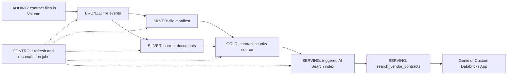

# Medallion Incremental Contract Ingestion

## 1. Purpose

This document defines the implementation plan for moving GlobalMart vendor-contract ingestion from the current full overwrite job to a production-like Medallion architecture with incremental new, updated, and deleted file processing.

The design keeps the currently working AI Search contract intact:

- Gold remains a regular Delta table.
- AI Search remains a managed, triggered Delta Sync index over that table.
- The existing source table, index, endpoint, function, and Genie integration are not renamed or deleted.
- A full rebuild and reconciliation mode remains available for recovery.

The current implementation is a useful baseline, but `.mode("overwrite")` reprocesses unchanged files and does not provide a reliable file-deletion lifecycle. The target design makes file state explicit and updates only affected chunk rows.

## 2. Layer Marking Convention

Every object in this document is marked with one of these layer labels. Use the same labels in code comments, SQL comments, runbooks, diagrams, and object descriptions.

| Mark | Layer | Responsibility |
|---|---|---|
| `[LANDING]` | Source landing | Immutable or externally managed contract files in the Unity Catalog Volume |
| `[BRONZE]` | Raw ingestion | Append-oriented file observations and ingestion events, preserving source metadata and audit context |
| `[SILVER]` | Conformed state | Current document identity, content hash, lifecycle status, and normalized document metadata |
| `[GOLD]` | Business-ready data | Searchable contract chunks and structured supply-chain tables consumed by downstream tools |
| `[SERVING]` | Query and index serving | Managed AI Search index and SQL function exposed to Genie or an application |
| `[CONTROL]` | Orchestration and operations | Jobs, manifests, reconciliation, metrics, checkpoints, and deployment configuration |

Layer marks describe ownership and purpose. They are documentation metadata, not prefixes that should be added to existing Unity Catalog object names.

## 3. Marked Object Inventory

### 3.1 Existing and target objects

| Mark | Object | Current or target role | Status |
|---|---|---|---|
| `[LANDING]` | `/Volumes/globalmart/supply_chain/vendor_contracts` | Contract file landing area | Existing |
| `[BRONZE]` | `globalmart.supply_chain.contract_file_events_bronze` | Append-only file discovery and lifecycle events | New |
| `[SILVER]` | `globalmart.supply_chain.contract_file_manifest` | One current row per source file | New |
| `[SILVER]` | `globalmart.supply_chain.contract_documents_silver` | Current normalized document metadata and extracted text | New |
| `[GOLD]` | `globalmart.supply_chain.vendor_contract_chunks_index_source` | Regular Delta table containing searchable chunks | Existing; evolve in place |
| `[GOLD]` | `globalmart.supply_chain.dim_products` | Product dimension for Text-to-SQL | Existing |
| `[GOLD]` | `globalmart.supply_chain.dim_vendors` | Vendor dimension for Text-to-SQL | Existing |
| `[GOLD]` | `globalmart.supply_chain.fact_inventory_status` | Inventory facts for Text-to-SQL | Existing |
| `[SERVING]` | `globalmart.supply_chain.vendor_contract_chunks_index_rebuilt` | Managed AI Search Delta Sync index | Existing; preserve |
| `[SERVING]` | `globalmart.supply_chain.search_vendor_contracts` | Genie-facing table-valued retrieval function | Existing; preserve contract |
| `[SERVING]` | `globalmart-supply-chain-search` | AI Search endpoint | Existing; preserve |
| `[CONTROL]` | `refresh_vendor_contract_chunks` | Contract discovery, transformation, and Gold update job | Existing; refactor in place |
| `[CONTROL]` | `generate_mock_data` | Structured demo-data generation job | Existing |
| `[CONTROL]` | `scripts/local/create_vendor_contract_index.py` | Idempotent endpoint/index provisioning | Existing |
| `[CONTROL]` | `resources/dbai.resources.yml` | Declarative job deployment definition | Existing |
| `[CONTROL]` | Reconciliation and metrics queries | Completeness, freshness, and sync health checks | New |

### 3.2 Marking rules for future objects

1. Name tables by business purpose, not by layer. The `[LAYER]` mark belongs in documentation and object comments.
2. Apply the mark to every diagram node and data-flow step.
3. Add the mark to table and function comments where the platform supports comments.
4. Keep serving objects separate from Gold storage. The AI Search index is not a replacement for the Gold Delta table.
5. Do not mark a table `[SILVER]` merely because it is intermediate; it must contain conformed current-state data rather than raw observations.

## 4. Target Architecture

The pipeline is a micro-batch snapshot comparison:

1. Read the current file listing from `[LANDING]`.
2. Compute a stable `file_id` and content hash for each supported file.
3. Compare the listing with `[SILVER] contract_file_manifest`.
4. Write `NEW`, `UPDATED`, and `DELETED` events to `[BRONZE]`.
5. Update only affected current document rows in `[SILVER]`.
6. Remove old chunks and insert replacement chunks for new or updated documents.
7. Remove chunks for deleted documents.
8. Trigger the managed `[SERVING]` index after the Gold transaction succeeds.

## 5. Target Data Contracts

### 5.1 `[BRONZE] contract_file_events_bronze`

Append one event per observed file state or detected deletion. Recommended columns:

| Column | Type | Meaning |
|---|---|---|
| `event_id` | STRING | Deterministic hash of `run_id`, `file_id`, `content_hash`, and event type |
| `run_id` | STRING | Ingestion run identifier |
| `observed_at` | TIMESTAMP | Time the Volume was scanned |
| `file_id` | STRING | Stable identity based on normalized source path |
| `source_path` | STRING | Full Volume path |
| `source_file` | STRING | File name |
| `event_type` | STRING | `NEW`, `UPDATED`, `DELETED`, or `UNCHANGED` |
| `content_hash` | STRING | SHA-256 hash of file bytes when present |
| `source_modified_at` | TIMESTAMP | File modification time when present |
| `source_size_bytes` | BIGINT | File size when present |
| `is_supported` | BOOLEAN | Whether the extension is ingestible |
| `error_message` | STRING | Discovery or extraction error, if any |

Bronze is append-only for auditability. A rerun with the same `run_id` and source snapshot must not create duplicate actionable events.

### 5.2 `[SILVER] contract_file_manifest`

Maintain one current row per `file_id`:

- `file_id`
- `source_path`
- `source_file`
- `content_hash`
- `source_modified_at`
- `source_size_bytes`
- `document_version`
- `lifecycle_status` (`ACTIVE`, `DELETED`, `FAILED`)
- `last_event_type`
- `last_run_id`
- `first_seen_at`
- `last_seen_at`
- `processed_at`
- `processing_error`

The content hash is the change detector. Modification time and size are useful diagnostics and scan optimization hints, but they must not be the sole update key.

### 5.3 `[SILVER] contract_documents_silver`

Maintain the current normalized document representation used to create chunks:

- `file_id`
- `document_version`
- `source_path`
- `source_file`
- `content_hash`
- `normalized_text`
- `vendor_id`
- `vendor_name`
- `support_tier`
- `region_covered`
- `lifecycle_status`
- `extracted_at`
- `extraction_error`

Store extracted text here so chunking can be retried without rereading the source file. Do not expose failed or deleted documents to Gold.

### 5.4 `[GOLD] vendor_contract_chunks_index_source`

Evolve the existing table in place. Retain all current AI Search columns and add:

- `file_id`: stable document identity
- `content_hash`: source version used to produce the chunk
- `document_version`: monotonically increasing version for the file
- `is_active`: explicit current-row indicator
- `processed_at`: time the chunk was produced

Recommended identity remains a deterministic `chunk_id`, generated from `file_id`, `document_version`, `chunk_index`, and chunk content. The AI Search primary key must remain unique across active and replaced rows.

The Gold write for one run must be atomic from the table consumer's perspective: delete prior chunks for affected file IDs, then insert the replacement set in one Delta transaction or equivalent isolated write pattern. Deleted files must have no active rows in Gold.

### 5.5 `[SERVING]` objects

The managed index continues to use:

- Source: `globalmart.supply_chain.vendor_contract_chunks_index_source`
- Primary key: `chunk_id`
- Text column: `chunk_text`
- Pipeline type: `TRIGGERED`
- Embedding endpoint: `databricks-qwen3-embedding-0-6b`

Keep `search_vendor_contracts` stable for Genie. New metadata columns may be added to the source and index when useful, but existing return columns and filter semantics should remain backward compatible.

## 6. Incremental Processing Algorithm

### Phase A: Discover

1. Read supported files from the Volume using `binaryFile` or an equivalent metadata scan.
2. Normalize paths before calculating `file_id`.
3. Calculate a SHA-256 content hash for each file. For large files, use a streaming or distributed implementation.
4. Generate one scan snapshot identified by `run_id`.

### Phase B: Classify

Compare the scan snapshot with active Silver manifest rows:

- Path absent from the manifest: `NEW`.
- Same `file_id`, different `content_hash`: `UPDATED`.
- Manifest file absent from the current scan: `DELETED`.
- Same identity and content hash: `UNCHANGED`.

Only `NEW`, `UPDATED`, and `DELETED` files proceed to document and Gold mutation steps.

### Phase C: Apply Silver state

1. Append classified events to Bronze using an idempotent `event_id`.
2. For new and updated files, extract and normalize text and upsert Silver document and manifest rows.
3. For deleted files, mark the manifest and document rows `DELETED`; retain history rather than physically removing audit rows.
4. On extraction failure, mark the document `FAILED`, retain the prior active version when policy allows, and do not delete valid existing Gold chunks until a replacement is ready.

### Phase D: Apply Gold chunks

For each successfully processed new or updated file:

1. Generate chunks from the Silver normalized text.
2. Assign the new document version and deterministic chunk IDs.
3. Remove the prior active chunks for the affected `file_id`.
4. Insert replacement chunks with the new hash and version.

For each deleted file, remove or deactivate all Gold chunks for that `file_id`. Prefer a physically removed active row when the AI Search source contract requires the index to stop returning deleted content; retain deletion history in Bronze and Silver.

### Phase E: Serve

1. Confirm the Gold transaction committed.
2. Trigger the AI Search update.
3. Poll until the index update completes or fails.
4. Record source row count, active file count, affected file count, and index status in control metrics.

## 7. Implementation Plan

### Step 1: Establish contracts and labels

- Add the layer legend and marked inventory from this document to architecture/runbook material.
- Add layer marks to table and function comments where practical.
- Freeze the existing serving schema and smoke tests before changing ingestion.

### Step 2: Add Bronze and Silver tables

- Create the Bronze events table with Delta and Change Data Feed enabled.
- Create the Silver manifest and current-document tables with Delta constraints where supported.
- Add a control run table or equivalent metrics output for `run_id`, counts, status, error, and timestamps.
- Grant the refresh job only the required Volume read and schema/table write permissions.

### Step 3: Refactor discovery and identity

- Extract file discovery, hashing, classification, and metadata mapping into testable functions.
- Use stable path-based `file_id`; do not use content hash alone because a renamed file is a new document identity.
- Make the scan and event writes idempotent.

### Step 4: Introduce incremental Gold writes

- Add the new Gold metadata columns without breaking the existing index columns.
- Implement affected-file replacement and deletion handling.
- Keep `FULL_REBUILD` or `RECONCILE` mode that regenerates all Silver and Gold state from the Volume.
- Run a comparison between overwrite output and incremental output before enabling incremental mode by default.

### Step 5: Orchestrate serving sync

- Add an explicit post-refresh index-trigger step or job task.
- Do not trigger AI Search when the Gold transaction fails.
- Poll and record terminal index status.
- Make index triggering retryable without rerunning extraction or Gold mutation.

### Step 6: Roll out in phases

1. **Shadow mode:** compute classifications and expected affected chunks while continuing the current overwrite path.
2. **Dual validation:** compare incremental output to a full rebuild using file IDs, hashes, chunk counts, and chunk text hashes.
3. **Incremental default:** enable new/update/delete mutation after comparison passes for representative files.
4. **Operational hardening:** add alerts, retention, reconciliation, and scheduled full rebuilds.

## 8. Idempotency, Failure Handling, and Recovery

- Use a unique `run_id` per execution and deterministic event IDs.
- A retry of a completed run must not duplicate Bronze events, Silver versions, or Gold chunks.
- Commit Silver and Gold changes only after extraction and chunk generation succeed for each affected file.
- Keep the prior active document and chunks when an update fails, and surface the failure in control metrics.
- Treat index sync as a separate retryable operation after Gold commit.
- Run a scheduled reconciliation that compares Volume files, Silver active manifest rows, Gold active file IDs, and indexed row counts.
- Retain Bronze events and prior Silver versions according to an agreed audit retention period.
- Use full rebuild mode to recover from missed Volume events, CDF retention gaps, corrupted state, or manual table repair.

## 9. Testing Plan

### Unit tests

- Stable `file_id` for path normalization.
- Content hash changes classify as `UPDATED`.
- Same path and hash classify as `UNCHANGED`.
- Missing manifest file classifies as `DELETED`.
- Deterministic chunk IDs remain stable for identical document versions.
- Unsupported files are ignored and reported.

### Integration tests

Use a temporary or dedicated test location with these cases:

1. Add a new contract and verify Bronze, Silver, Gold, and index visibility.
2. Replace contract content and verify old chunks disappear and new chunks are searchable.
3. Delete a contract and verify no active Gold chunks or retrieval results remain.
4. Rerun the same snapshot and verify no duplicate events or chunks.
5. Force extraction failure and verify the previous valid version remains served.
6. Fail index synchronization after Gold commit and verify retry does not mutate Gold again.
7. Compare incremental output with a full rebuild for the same Volume snapshot.

### Acceptance checks

- No unchanged file is re-extracted in incremental mode.
- Deleted content is not returned by `search_vendor_contracts` after index sync completes.
- Existing Genie SQL and retrieval smoke tests continue to pass.
- Reconciliation reports zero unexplained differences.
- Index update status is observable and actionable.

## 10. Operational Metrics

At minimum, record per run:

- `files_seen`, `files_new`, `files_updated`, `files_deleted`, `files_unchanged`
- `documents_extracted`, `documents_failed`
- `chunks_deleted`, `chunks_inserted`, `active_gold_chunks`
- `bronze_events_written`, `duplicate_events_skipped`
- `index_triggered_at`, `index_completed_at`, `index_status`
- `run_status`, `error_count`, and representative error messages

Alert on extraction failures, reconciliation mismatches, stale index status, unexpected deletion volume, and repeated retries.

## 11. Rollback and Compatibility

The first rollout must keep the current full overwrite path available behind an explicit mode switch. If incremental processing produces an unexpected result:

1. Stop incremental runs.
2. Run the full rebuild/reconciliation mode from the current Volume snapshot.
3. Trigger the managed index.
4. Validate the retrieval smoke tests.
5. Preserve Bronze and Silver evidence for diagnosis.

Do not delete or rename `vendor_contract_chunks_index_source`, `vendor_contract_chunks_index_rebuilt`, `globalmart-supply-chain-search`, or `search_vendor_contracts` during rollout.

## 12. Definition of Done

The migration is complete when:

- Every object is marked with its `[LAYER]` responsibility in documentation and supported object comments.
- Bronze events and Silver current state are populated for the contract Volume.
- New, updated, unchanged, and deleted files are classified correctly.
- Gold changes are incremental, atomic, and idempotent.
- Triggered AI Search synchronization is automated and observable.
- Full rebuild/reconciliation is tested and documented.
- Add, update, delete, retry, and failure integration tests pass.
- Genie and retrieval consumers continue to use the existing serving names and contracts.
