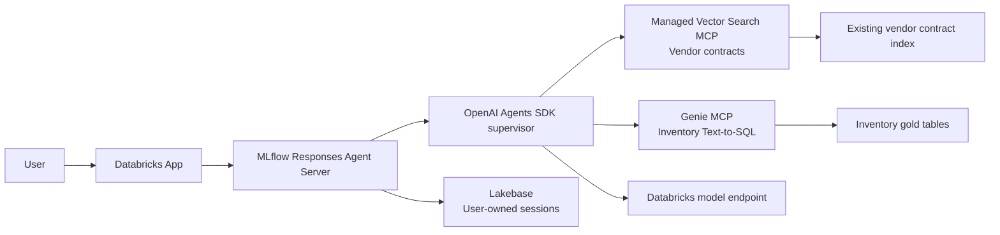

# Supply-Chain Supervisor Architecture

## Decision

The user-facing agent is a new Databricks App at `agents/supply_chain_supervisor`. It uses the OpenAI Agents SDK inside an MLflow Responses Agent Server. The supervisor directly connects to two managed Databricks MCP servers:

- Managed AI Search MCP for vendor contract retrieval.
- Genie MCP for inventory Text-to-SQL over curated supply-chain tables.

The existing `supply_chain_agent` remains a standalone contract specialist. The supervisor does not call that App as a nested agent and does not duplicate its retrieval implementation.

## Request Flow

The supervisor routes contract-only questions to AI Search, inventory-only questions to Genie, and hybrid questions to both. It reconciles the results without inventing citations, SQL, quantities, clauses, or actions.

## Identity and State

The primary identity path is on-behalf-of (OBO). The forwarded App access token creates the workspace client used by the model, MCP servers, and Lakebase. This preserves the requesting user's Unity Catalog and Genie permissions. The model client is request-scoped so concurrent users cannot overwrite a process-global OBO client.

Lakebase `AsyncDatabricksSession` stores durable conversation turns when configured. A request-carried history fallback keeps local development and unconfigured environments usable. Session identifiers come from `context.conversation_id` or `custom_inputs.session_id`.

## Guardrails

- V1 is read-only.
- Tool failures and empty results are reported rather than replaced with model knowledge.
- Contract answers should retain source metadata returned by managed AI Search.
- Genie is limited to its configured inventory space and governed tables.
- Future write-capable MCP tools require a separate explicit human-approval step.

## Why This Framework

The OpenAI Agents SDK is the best fit because its native `McpServer` supports managed Vector Search and Genie MCP endpoints in one agent. Supervisor API remains a possible later platform migration, but the native managed AI Search MCP path is the controlling requirement for this implementation. LangGraph is reserved for a future workflow that needs explicit graph checkpoints, resumable approvals, or long-running branches.