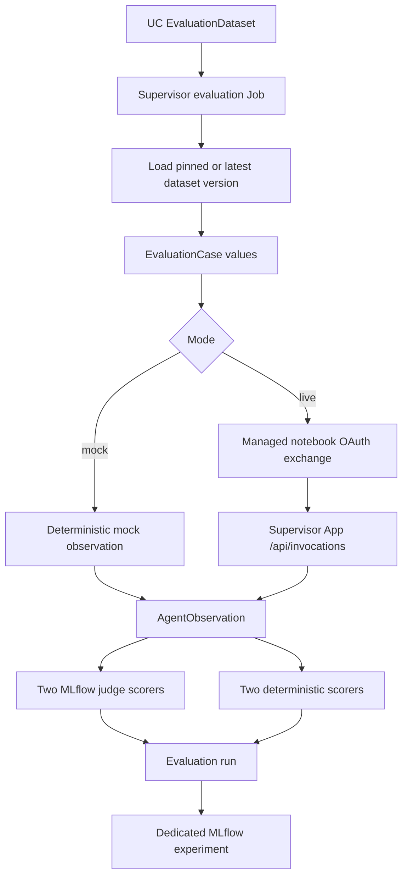
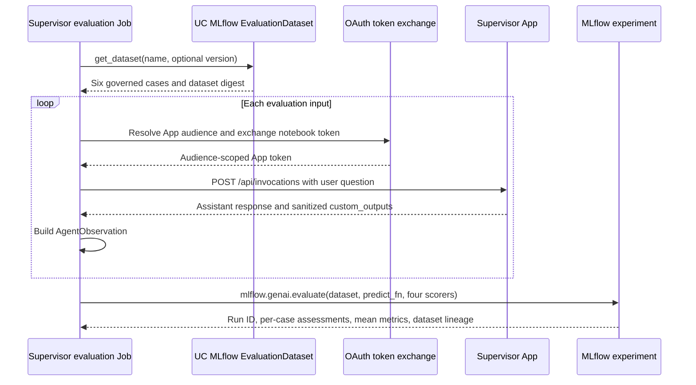

# Agent Evaluation Framework: Supervisor and Frozen Contract Paths

## Purpose

This repository has two intentionally separate evaluation paths:

- The Supervisor evaluator is the current reusable framework. It loads a Unity Catalog-backed MLflow `EvaluationDataset`, invokes the deployed Supervisor App, normalizes the response, and records MLflow GenAI evaluation results.
- The contract evaluator is frozen regression coverage for the existing contract App. It must remain unchanged while Supervisor evaluation work is developed or run.

The Supervisor evaluator does not import the contract App, call its internal search functions, or reuse its contract-specific dataset and scorers.

## Implemented Supervisor Framework



The implementation is split across these modules:

| Module | Responsibility |
|---|---|
| [evaluation/job.py](../agents/supply_chain_supervisor_evaluation/evaluation/job.py) | Job/notebook entry point, parameters, dataset loading, App invocation, and evaluation call |
| [common_utils/evaluation/dataset.py](../common_utils/evaluation/dataset.py) | Load a managed MLflow dataset and map records to shared cases |
| [common_utils/evaluation/models.py](../common_utils/evaluation/models.py) | Immutable `EvaluationCase` and sanitized `AgentObservation` models |
| [common_utils/evaluation/adapters.py](../common_utils/evaluation/adapters.py) | App HTTP transport, managed OAuth exchange, response normalization, and retry behavior |
| [common_utils/evaluation/mlflow.py](../common_utils/evaluation/mlflow.py) | Register the two built-in MLflow judges and run evaluation |
| [common_utils/evaluation/scorers.py](../common_utils/evaluation/scorers.py) | Register the two deterministic custom scorers |
| [scripts/deployable/provision_supervisor_evaluation.py](../scripts/deployable/provision_supervisor_evaluation.py) | Create or resolve the experiment, UC schema, and evaluation dataset; merge seed cases |
| [scripts/deployable/grant_supervisor_evaluation_access.py](../scripts/deployable/grant_supervisor_evaluation_access.py) | Grant the evaluator and App the required Databricks and UC permissions |

## UC Dataset, Experiment, and Human Labeling

The governed evaluation dataset is:

- Name: `globalmart.agent_evaluation.supervisor_cases`
- Unity Catalog location: catalog `globalmart`, schema `agent_evaluation`
- Dataset ID: `746ef70e-1b5b-4e5c-8c7a-3eb3e09fdab0`
- Current verified version digest: `fc9d70ad2d45bb5a4be558bf2dedcaa6`
- Seed cases: six Supervisor scenarios

The dedicated MLflow experiment is:

- Name: `/Shared/globalmart-supply-chain-supervisor-evaluation-dev`
- Experiment ID: `2285133248665247`

The provisioning script calls `create_dataset(name=..., experiment_id=...)` when the dataset does not exist. Therefore the dataset is a managed MLflow `EvaluationDataset`, registered under Unity Catalog and associated with the dedicated experiment. It is available from the experiment's Datasets view in the Databricks UI. The Job loads it with `mlflow.genai.datasets.get_dataset()` by name and optional version.

The dataset is also associated with each evaluation run at run time. MLflow records the dataset name, dataset ID, source table, and version digest as an input to the run. This makes a score reproducible against the exact dataset version used by the evaluator; it is stronger than recording only a free-form dataset-name tag.

### Domain-expert review and labeling

The registered dataset is ready to be reviewed by domain experts, but registration does not create a human labeling session automatically. Expert review is a separate workflow that requires:

- a labeling session or equivalent human-feedback setup;
- a label schema, such as expected answer, required facts, acceptable tool families, or review outcome;
- reviewer access to the experiment and dataset;
- a process for approving and versioning reviewed expectations.

Experts can inspect the dataset in the MLflow UI and add or correct expectations through the supported review workflow. After review, run the evaluator against the reviewed dataset version by setting `EVALUATION_DATASET_VERSION`; do not silently overwrite a benchmark used for prior comparisons. This repository provisions the dataset records and machine-readable expectations, but it does not provision the labeling session or collect human labels.

## Evaluation Scores

The evaluator registers exactly four scorers in [mlflow.py](../common_utils/evaluation/mlflow.py):

1. `supervisor_correctness`: MLflow built-in `Correctness` judge.
2. `supervisor_relevance_to_query`: MLflow built-in `RelevanceToQuery` judge.
3. `required_fact_coverage`: deterministic fraction of required facts present in the final answer.
4. `tool_routing_accuracy`: deterministic fraction of expected managed tool families observed in the response metadata.

The two built-in judges use the Databricks-hosted model configured by `JUDGE_MODEL`, normally `databricks-meta-llama-3-1-8b-instruct`. All four scorers use mean aggregation. MLflow displays the aggregate values as the scorer names with a `/mean` suffix and also stores per-case assessments.

The custom scorers intentionally have narrow responsibilities. They do not replace the built-in judges, and the evaluator does not register additional correctness, relevance, groundedness, or retrieval judges.

## Evaluation Dataset Shape

The seed records live in [evaluation/dataset.jsonl](../agents/supply_chain_supervisor_evaluation/evaluation/dataset.jsonl). Records use MLflow's `inputs` and `expectations` fields:

```json
{
  "inputs": {
    "case_id": "hybrid-contract-inventory",
    "question": "Which vendors have delayed inventory and what contract remedies apply?"
  },
  "expectations": {
    "case_id": "hybrid-contract-inventory",
    "scenario": "hybrid",
    "required_facts": ["delayed inventory", "contract remedy"],
    "expected_tool_families": ["genie", "vector_search"],
    "reference_answer": "..."
  }
}
```

[dataset.py](../common_utils/evaluation/dataset.py) converts each record into an immutable `EvaluationCase` with the case ID, question, scenario, required facts, expected tool families, reference answer, and expected behavior. The evaluator indexes cases by ID so the MLflow `predict_fn` can resolve mapping-style inputs reliably.

## Job Configuration

The resource definition is [supervisor_evaluation.resources.yml](../agents/supply_chain_supervisor_evaluation/resources/supervisor_evaluation.resources.yml). Its task runs the Supervisor evaluation Job in live mode.

| Parameter | Meaning | Default or current value |
|---|---|---|
| `EVALUATION_DATASET` | UC-backed MLflow EvaluationDataset name | `globalmart.agent_evaluation.supervisor_cases` |
| `EVALUATION_DATASET_VERSION` | Optional immutable dataset version; blank means latest | blank |
| `SUPERVISOR_APP_URL` | Deployed Supervisor App URL | required in live mode |
| `SUPERVISOR_APP_NAME` | App name used to discover the OAuth audience | `agent-supply-chain-sup-dev` |
| `MODE` | `mock` or `live` | `live` in the Job resource |
| `JUDGE_MODEL` | Databricks-hosted judge model | `databricks-meta-llama-3-1-8b-instruct` |
| `MLFLOW_EXPERIMENT_NAME` | Dedicated experiment fallback | `/Shared/globalmart-supply-chain-supervisor-evaluation-dev` |
| `MLFLOW_EXPERIMENT_ID` | Resolved dedicated experiment ID | `2285133248665247` |
| `MLFLOW_TRACKING_URI` | Databricks MLflow backend | `databricks` in the Job resource |
| `MLFLOW_TRACING_SQL_WAREHOUSE_ID` | SQL warehouse used by trace assessments | `a749a7ee30b8f4f4` |
| `DATABRICKS_PROFILE` | Local SDK profile fallback | optional |
| `DATABRICKS_TOKEN` | Explicit local bearer-token diagnostic path | optional |
| `OUTPUT` | Optional JSON summary output path | `evaluation/results.json` |

The Job's `base_parameters` pass these values through Databricks widgets. When `dbutils` is unavailable, [job.py](../agents/supply_chain_supervisor_evaluation/evaluation/job.py) reads the same names from environment variables and command-line arguments.

## Supervisor Job Lifecycle



### Dataset loading

`load_uc_dataset()` calls `get_dataset(name=dataset_name, version=dataset_version)`. A blank `EVALUATION_DATASET_VERSION` is converted to `None`, which loads the latest dataset version. `cases_from_dataset()` calls `dataset.to_df()`, validates each record, and creates the shared cases.

### Live App invocation

The Supervisor adapter sends:

```json
{
  "input": [
    {"role": "user", "content": "the case question"}
  ]
}
```

The endpoint is normalized to `/api/invocations` unless the supplied URL already ends in `/invocations`. The adapter extracts the final assistant text and only retains sanitized evaluation metadata:

- tool family names;
- tool names and families;
- source mappings supplied by the App;
- short error strings;
- unavailable-tool names and history backend metadata.

It does not place access tokens or raw authentication headers in MLflow outputs.

### Managed notebook authentication

In a managed Job, the adapter obtains the runtime notebook token and looks up the App's `oauth2_app_client_id`. It exchanges the notebook token at `<workspace-url>/oidc/v1/token` using:

```text
grant_type=urn:ietf:params:oauth:grant-type:token-exchange
subject_token_type=urn:databricks:params:oauth:token-type:personal-access-token
requested_token_type=urn:ietf:params:oauth:token-type:access_token
scope=all-apis
audience=<app-oauth-client-id>
```

The returned audience-scoped access token is used only for the App request. Exchange diagnostics whitelist and truncate response fields; tokens are never logged. Local profile authentication and the explicit token invoker are diagnostic paths, not substitutes for the managed Job exchange.

### Mock mode

Mock mode does not contact the App. It uses each case's reference answer and expected tool families to produce a deterministic `AgentObservation`, allowing tests and MLflow plumbing checks without network access. It is not a substitute for live validation because it cannot exercise App authentication, routing, tool execution, or tracing.

## MLflow Evaluation Output

The adapter emits an MLflow-compatible output payload:

```json
{
  "answer": "...",
  "response": "...",
  "sources": [],
  "errors": [],
  "evaluation": {
    "tool_families": ["genie", "vector_search"],
    "tool_calls": [{"family": "genie", "name": "ask"}]
  },
  "metadata": {}
}
```

`mlflow.genai.evaluate()` receives the managed dataset directly, invokes the `predict_fn` for each record, runs the four registered scorers, and records the dataset input and version digest on the evaluation run. The optional `OUTPUT` file is only a short job summary containing dataset, mode, experiment, scorer names, and run ID.

## Verified Live Run

The verified Supervisor evaluation completed successfully with:

- Job run: `170873889581988`
- MLflow run: `e3e5a4b2c61c44f5bb78cf190207677f`
- Dataset digest: `fc9d70ad2d45bb5a4be558bf2dedcaa6`
- Traces: six `OK` traces, one prediction span per case, no response errors
- `supervisor_correctness/mean`: `0.80`
- `supervisor_relevance_to_query/mean`: `0.8333333333333334`
- `required_fact_coverage/mean`: `0.5611111111111111`
- `tool_routing_accuracy/mean`: `1.0`

The run is valid evidence for the Supervisor path. Earlier failed or unauthorized runs must not be used as evaluation results.

## Provisioning and Permissions

Run [provision_supervisor_evaluation.py](../scripts/deployable/provision_supervisor_evaluation.py) before the evaluation Job when the experiment or dataset has not been provisioned. It:

1. Creates `globalmart.agent_evaluation` if needed.
2. Resolves or creates the dedicated experiment.
3. Gets or creates `globalmart.agent_evaluation.supervisor_cases` with that experiment ID.
4. Merges seed records by case ID and preserves the managed dataset version history.

Run [grant_supervisor_evaluation_access.py](../scripts/deployable/grant_supervisor_evaluation_access.py) with the evaluator identity and App identity before live evaluation. The grants cover the UC catalog/schema and source tables, evaluation dataset table, trace tables, SQL warehouse, MLflow experiment, Supervisor App, Genie resource, model endpoint, and Vector Search endpoint as applicable to the configured environment.

The contract App's permissions are outside this workflow. Do not alter them while preparing Supervisor evaluation.

## Validation Runbook

1. Run the focused Supervisor tests:

   ```bash
   cd /home/arvind/workspace/dbai
   PYTHONPATH=. uv run --with pytest pytest -q agents/supply_chain_supervisor_evaluation/tests/test_evaluation.py
   ```

2. Validate and deploy only the Supervisor evaluation bundle:

   ```bash
   databricks bundle validate -t dev
   databricks bundle deploy -t dev
   ```

3. Run the evaluation Job in `live` mode with the deployed Supervisor App URL and the dedicated experiment parameters.

4. Verify the MLflow run:

   - the run is `FINISHED`;
   - all six traces are `OK`;
   - every case has one prediction span;
   - no response contains an evaluator error;
   - exactly the four aggregate scorer metrics are present;
   - the UC dataset ID and version digest are recorded as run inputs.

5. Inspect tool-routing metadata for the expected `genie` and `vector_search` families without exposing credentials or full raw tool payloads.

6. After validation, stop only the temporary Supervisor App `agent-supply-chain-sup-dev`. Verify that the existing contract App remains stopped and unchanged.

## Frozen Contract Evaluation Boundary

The contract path remains a regression baseline and is not the implementation described above:

- [Contract App Job](../agents/supply_chain_agent/evaluation/job.py) evaluates the deployed contract App.
- [Contract runner](../agents/supply_chain_agent/evaluation/runner.py) contains contract-specific cases, retrieval scoring, mock search fixtures, and a direct-search CLI.
- [Contract MLflow logging](../agents/supply_chain_agent/evaluation/mlflow_logging.py) contains the older contract reporting path.

These files use contract concepts such as vendor IDs, source files, chunk indices, and contract evidence. They do not load the Supervisor UC dataset and must not be used as imports for the Supervisor Job. The Supervisor path uses [common_utils/evaluation/](../common_utils/evaluation/) instead.

## Useful Commands

Run the Supervisor tests locally:

```bash
cd /home/arvind/workspace/dbai
PYTHONPATH=. uv run --with pytest pytest -q agents/supply_chain_supervisor_evaluation/tests/test_evaluation.py
```

Run the Supervisor Job in mock mode after the dataset and experiment exist:

```bash
cd /home/arvind/workspace/dbai
PYTHONPATH=. uv run python agents/supply_chain_supervisor_evaluation/evaluation/job.py \
  --mode mock \
  --dataset globalmart.agent_evaluation.supervisor_cases \
  --experiment-id 2285133248665247
```

Run live mode from a managed Job by setting `SUPERVISOR_APP_URL`, `SUPERVISOR_APP_NAME`, `EVALUATION_DATASET`, `MLFLOW_EXPERIMENT_ID`, and `JUDGE_MODEL` through the Bundle parameters. Do not place access tokens in source files, dataset records, or evaluation artifacts.